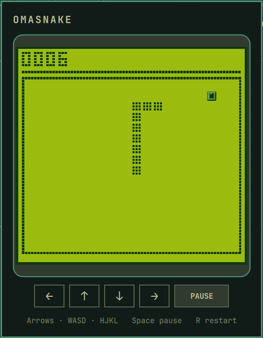

# Omasnake



Omasnake is a theme-aware monochrome Snake game for the Omarchy bar, inspired
by classic mobile phones. Guide a pixel-art snake, collect Omarchy marks, grow
longer, and chase a high score in a compact popup attached to the bar.

## Requirements

- Omarchy 4 with the Quattro shell plugin system.
- No additional packages or external services.

## Installation

Install and enable Omasnake directly from its public Git repository:

```bash
omarchy plugin add https://github.com/Faeric/omasnake.git --enable
```

The plugin is added under
`~/.config/omarchy/plugins/io.github.faeric.omasnake`. It never modifies files
under `/usr/share/omarchy` and does not require `sudo` or `pkexec`.

## Controls

- Arrow keys, `WASD`, or `HJKL`: steer the snake.
- Space, Enter, or `P`: start or pause the game.
- `R`: restart the game.
- Escape: close the window.
- Right-click the bar icon: start a new game.
- Middle-click the bar icon: pause or resume.

The controls below the game screen also make the game fully playable with a
mouse.

## Updating

```bash
omarchy plugin update io.github.faeric.omasnake
```

## Removal

```bash
omarchy plugin remove io.github.faeric.omasnake
```

## Development

Validate the package with the same manifest rules used by Omarchy:

```bash
omarchy plugin validate .
./tests/check.sh
```

## License and trademarks

The Omasnake source code is available under the [MIT License](LICENSE).

The bundled Omarchy mark is a third-party brand asset and is not covered by
the MIT License. See [THIRD_PARTY_NOTICES.md](THIRD_PARTY_NOTICES.md) before
redistributing the package.

Omasnake is an independent community project. It is not an official Omarchy
plugin and is not endorsed by Omarchy or 37signals.
